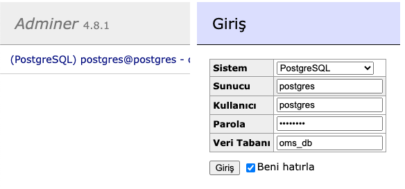
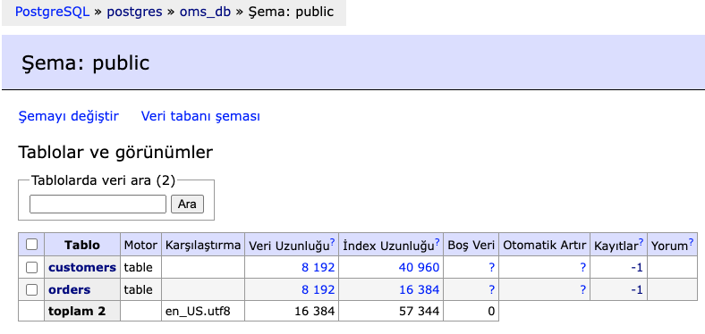
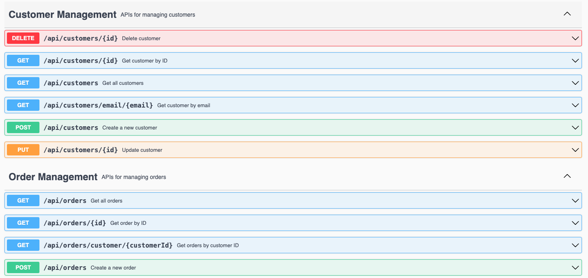
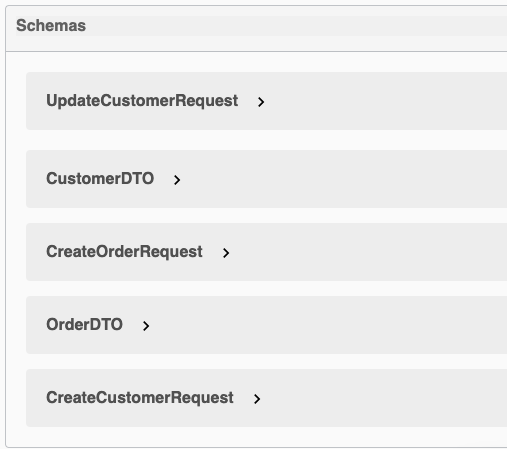
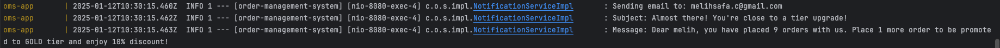
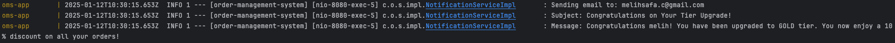

# Order Management System

A Spring Boot application that manages customer orders with a tiered discount system.

## Features

### Customer Management
- Create, read, update, and delete customers
- Customer information includes name and email
- Automatic customer tier progression based on order count:
  - REGULAR: Default tier (0% discount)
  - GOLD: After 10 orders (10% discount)
  - PLATINUM: After 20 orders (20% discount)

### Order Management
- Create and retrieve orders
- Automatic discount calculation based on customer tier
- Track order history per customer

### Database Schema
#### Customer Entity
- Fields:
    - id (Long)
    - name (String)
    - email (String, unique)
    - tier (CustomerTier enum)
    - totalOrders (Integer)

#### Order Entity
- Fields:
    - id (Long)
    - customer (Customer)
    - amount (Double)
    - discountAmount (Double)
    - finalAmount (Double)
    - orderDate (LocalDateTime)

### Screenshots

#### PostgreSQL Database Login in Adminer


#### PostgreSQL Database Structure in Adminer

*PostgreSQL database structure showing Customer and Order tables in Adminer*

#### Swagger API Documentation

*OpenAPI documentation showing all available endpoints*

#### Swagger Schemas

*Overview of used schemas in swagger*

#### Notification Examples

*Push notification sent to customers who are close to a tier upgrade.*


*Notification sent to customers who have just had their tier upgraded.*

## Tech Stack

- Java 21
- Spring Boot 3.2.1
- Gradle
- PostgreSQL 16
- Docker & Docker Compose
- OpenAPI (Swagger) for API documentation

## Prerequisites

- Docker Desktop / Orbstack or any other containerization tool
- Java 21 (for local development)

## Running the Application

### Using Docker Compose (Recommended)

1. Clone the repository
2. Start the application:
   ```bash
   docker-compose up --build
   ```
   This will start:
   - PostgreSQL database on port 5432
   - Spring Boot application on port 8080
   - Adminer (database management) on port 8081

### Accessing the Application

- API Documentation: http://localhost:8080/swagger-ui.html
- Database Management: http://localhost:8081

*Note: The credentials given below at environment variables and used for local development purposes only.*

## API Endpoints

### Customer Endpoints
- POST `/api/customers` - Create a new customer
- GET `/api/customers` - Get all customers
- GET `/api/customers/{id}` - Get customer by ID
- GET `/api/customers/email/{email}` - Get customer by email
- PUT `/api/customers/{id}` - Update customer
- DELETE `/api/customers/{id}` - Delete customer

### Order Endpoints
- POST `/api/orders` - Create a new order
- GET `/api/orders` - Get all orders
- GET `/api/orders/{id}` - Get order by ID
- GET `/api/orders/customer/{customerId}` - Get orders by customer ID

## Environment Variables

The application uses the following environment variables (defined in `.env`):

```properties
POSTGRES_DB=oms_db
POSTGRES_USER=postgres
POSTGRES_PASSWORD=postgres
```
*Note: The credentials shown above are for local development purposes only. In a production environment, sensitive information should be properly secured and never committed to version control.*

## Development

### Building the Application
```bash
./gradlew clean build
```

### Running Tests
```bash
./gradlew test
```

## Project Structure

```
src/
├── main/
│   ├── java/
│   │   └── com/
│   │       └── oms/
│   │           ├── controller/    # REST controllers
│   │           ├── dto/           # Data Transfer Objects
│   │           ├── entity/        # JPA entities
│   │           ├── repository/    # Data access layer
│   │           ├── service/       # Business logic
│   │           └── config/        # Configuration classes
│   │           └── exception/     # Exception handling
│   └── resources/
│       └── application.properties # Application configuration
└── test/
    └── java/                     # Test classes
``` 

### CustomerService Tests
- Create customer (success and failure scenarios)
- Get customer by ID
- Get customer by email
- Get all customers
- Update 
- Delete customer
- Email uniqueness validation
- Input validation using @Valid

### OrderService Tests
- Create order (success and failure scenarios)
- Get order by ID
- Get orders by customer ID
- Get all orders
- Discount calculation for different customer tiers
- Customer tier progression after order creation
- Edge cases (maximum/minimum amounts)
- Tier upgrade notifications
- Tier progression alerts
- Input validation using @Valid

### Missing Parts and Potential Improvements & Developments
- **Microservice Architecture with DDD concept**
  - Implemented in a different branch but not finished
  - 3 different service could have been implemented (customer-service, order-service and notification-service)
  - Kafka would be the choice for handling event messages. For contracts, schema registry might be used for consistency
- Integration tests for controllers
- Increasing the total test coverage (currently ~70%)
- Logging (Elasticsearch, Logstash, Kibana)
- Security (OAuth2, JWT, Keycloak)
- Kubernetes (Could be used after DDD implementation)
- CI/CD pipelines for production
- Monitoring and metrics (New relic)
- Health checks
- Environment variables (Rather than .env)

### Tried, Denied or Failed Ideas
- **DDD Concept Implementation with multiple microservices**
  - Initially developed a monolithic application which is still the case, and then tried to migrate my project into a more distributed architecture.
  - Migration was not successful at the end since the planning about this improvement not planned at first, hence it got more difficult to implement in a short time period.
  - After this failed attempt, reverted changes into a monolithic architecture again, and tried to implement it at its best.
- Another idea was implementing the Customer Tier logic.
  - First of all, implement it as enum in the customer class but it has association with order class.
  - Then, I thought about implementing it as a separate table in the database but it would be a waste of space since it has only 3 values and unnecessary to create a new table in terms of a monolithic application.
  - Finally, I decided to implement it as a separate enum entity.
- Used H2 in-memory database at first but then switched to PostgreSQL.
  - H2 was not a good choice for a production environment since it is an in-memory database and it didnt make sense to use it as a relational database.
  - PostgreSQL was a good choice for a potential production environment since it is a relational database and it is suitable for a distributed environment.